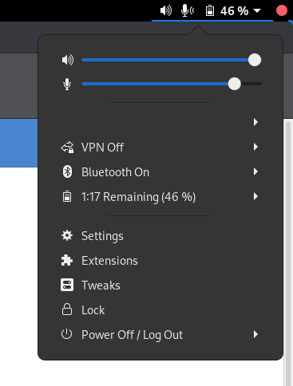

# Extensions in system menu

A GNOME extension that adds a menu item to the system menu which opens the Extensions app.

## Supported GNOME versions

- 3.36
- 3.38

## Installation

You can install it via https://extensions.gnome.org. Alternatively, you can download the `extensions-in-system-menu@leleat-on-github` folder and move it to your extensions folder. Local extensions are in `~/.local/share/gnome-shell/extensions/`. After moving the folder to the correct location, restart the GNOME shell (`Alt`+`F2`: enter `r`. On **Wayland** you need to logout).

## License

This extension is distributed under the terms of the GNU General Public License, version 2 or later. See the license file for details.
